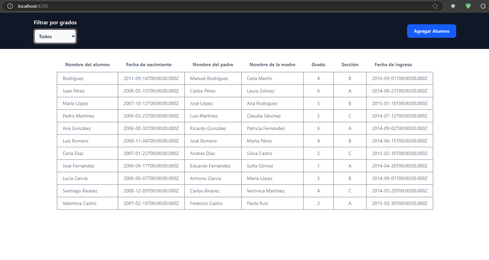
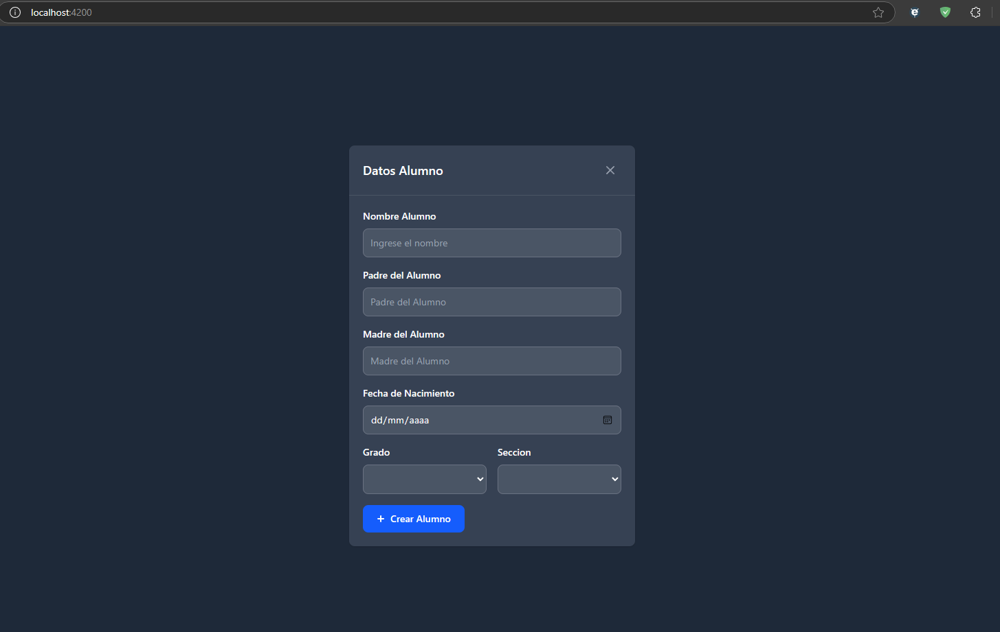

# EvaluacionNestJs

Esta es una App con Angular y NestJS como parte de una evaluación para Desarrollador NodeJS con NestJS




## Elementos utilizados

- **Frontend**: Angular (v18)
- **Backend**: NestJS
- **Base de Datos**: MongoDB
- **UI Framework**: TailwindCSS
- **Autenticación**: Api-key con Passport
- **contenedor**: Docker y docker-compose (Opcional)

## Requisitos

Antes de correr esta application, debe de tener estos herramientas instaladas

- [Node.js](https://nodejs.org/) (version: 20 o superior )
- [npm](https://www.npmjs.com/)
- [MongoDB](https://www.mongodb.com/try/download/community) (En este caso se uso de manera local con [MongoDBCompass](https://www.mongodb.com/products/tools/compass))
- [Docker](https://www.docker.com/get-started) - Para generar el contenedor (Opcional).

## Ejecutar

- **Clonar el repositorio**

```shell
git clone https://github.com/cityzenK/EvaluacionNestJs.git
```

- **Ejecutar Backend**

```shell
 cd ./backend
nest start
```

- **Ejecutar Frontend**

```shell
 cd ./frontend
ng serve
```

- **(Opcional) Docker**

```shell
docker-compose up --build
```
